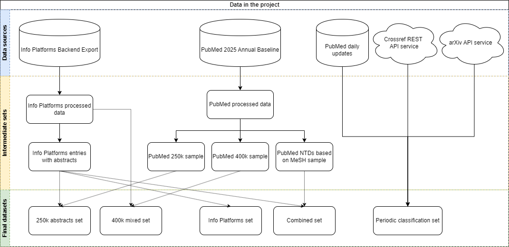

# AI-Powered Content Management Pipelines for Infolep & InfoNTD

Partnering with Analytics for a Better World (ABW) to support No Leprosy Remains (NLR) - the organization behind the Infolep and InfoNTD knowledge platforms - this project tackles the growing bottleneck of manually tagging biomedical literature. Millions of new abstracts land in PubMed every year, overwhelming the experts who have to decide whether each paper belongs on the platforms and, if so, which neglected tropical diseases it covers. The work tests modern AI techniques on two text-classification tasks - **entry inclusion** and **per-disease tagging** - to show how curation can scale without sacrificing quality.

## Technologies & Methods

- **PyTorch + HuggingFace Transformers** for fine-tuned BERT inclusion/disease classifiers.
- **scikit-learn SVM pipelines** with TF-IDF features for fast, CPU-friendly baselines.
- **Google Gemini 2.0 Flash** zero-shot prompts for flexible taxonomy updates.
- **pandas / numpy / joblib / tqdm** for data wrangling, model persistence, and evaluation.]
- **openpyxl + Tkinter** for a curator-facing Excel export and GUI proof of concept.

## Why the problem matters

Infolep and InfoNTD deliver curated knowledge on neglected tropical diseases. Historically, librarians sifted through RSS feeds, newsletters, and PubMed alerts, then hand-tagged every accepted entry with inclusion status plus disease labels. The paper flood now makes that process unsustainable:

- PubMed alone adds **1.5M+** new entries every year.
- Some diseases (e.g., leprosy) dominate the archive while others (e.g., podoconiosis) remain underrepresented.
- Abstract availability varies drastically with publication year, complicating automation.

This repository captures the end-to-end experiments that demonstrate how AI can relieve the bottleneck while keeping curators in control.

## Data sources & preparation

Data combines two pillars:

1. **Expert exports from the Infolep/InfoNTD backends** – 39k manually tagged publications with rich metadata (title, abstract, DOI, disease labels, regions, languages).
2. **PubMed 2025 Annual Baseline** – 36.5M XML entries enriched with MeSH terms, plus daily update feeds for fresh content.

The datasets were engineered to answer two questions:

- Is this publication relevant to the Info Platforms? (binary inclusion)
- Which diseases does it cover? (multi-label classification across 19 disease labels)

Special care was taken to deduplicate overlapping sources, resample negatives using exponentially decaying weights toward recent years, and augment low-sample diseases with MeSH-backed PubMed entries. The result is a set of balanced “lab” splits plus realistic “deployment” splits, illustrated in the data overview below.

## Modeling approaches & trade-offs

Four complementary strategies were benchmarked:

1. **Support Vector Machines (SVMs)**
   - TF-IDF + LinearSVC + calibrated probabilities.
   - Almost instant training/inference on CPU, excels when abstracts are short or missing.
   - Requires retraining for new disease labels but cheap to rerun.

2. **Fine-tuned BERT**
   - Contextual tokenization of title + abstract (≤512 tokens) with sigmoid heads for multi-label outputs.
   - Delivers the best raw accuracy on both inclusion and disease tasks.
   - Needs a GPU and hours of training, so heavier to maintain.

3. **Gemini 2.0 Flash (zero-shot)**
   - Prompt-only setup, no supervised training.
   - Handles taxonomy changes instantly and can list “extra” diseases outside the 19-label set.
   - Slightly lower recall and no probabilities, plus API cost/latency considerations.

4. **Ensembles**
   - Union and majority-vote schemes that combine the above models.
   - Boost recall in edge cases but do not consistently beat the best single model, largely because their errors often overlap.

## Experimental findings

All models cleared the performance bar needed for production trials. BERT posted the highest scores on the balanced benchmarks, but the gap over SVMs was tiny—especially when abstracts were missing—making SVMs a pragmatic choice for day‑to‑day use. Gemini’s zero-shot runs proved that prompt engineering alone can produce useful signals, though probability-based triage still favors supervised models.

Abstract availability matters: scores dip when only titles are provided, yet they remain high enough to keep “title-only” ingestion viable. For the multi-label disease task, both micro and macro F1 scores stayed above 0.9 on the combined dataset, indicating strong performance on frequent and rare diseases alike, with BERT holding a slim lead.

Per-disease inspection shows where more data or better prompts would help. Leishmaniasis, Chagas disease, and Zika are well captured; podoconiosis, yaws, and dracunculiasis suffer from low sample counts and overlapping vocabulary, hinting at the value of richer annotations or broader “Multiple NTDs” tags.

### Conclusions at a glance

- **All three model families performed strongly.** Even titles without abstracts provided enough signal with minimal penalty.
- **BERT delivered the top-line accuracy**, but only by a small margin; the extra compute may not always be worth it.
- **SVMs are the most resource-efficient**, offering 45× faster inference than BERT while staying within a few F1 points.
- **Gemini is the flexible safety net**, especially when new diseases, synonyms, or unstructured sources enter the pipeline.

## Scaling to the entire PubMed baseline

To gauge real-world impact, the trained inclusion and disease SVMs were run across the full PubMed 2025 baseline. They surfaced **188k** papers likely relevant to Infolep/InfoNTD, including tens of thousands not yet curated. The projected disease coverage gains are dramatic:

- Leishmaniasis: **×28.6** additional papers
- Chagas disease: **×34.2**
- Zika virus: **×86.8**
- Even niche diseases such as Noma and Podoconiosis see growth factors of **×8.7** and **×1.4**

These simulations show how automated monitoring can radically increase the breadth of the knowledge platforms while leaving final acceptance to human reviewers.

## Proof-of-concept workflow for curators

To make the research tangible for non-technical staff, a Tkinter-based control panel and Excel exporter wrap the entire workflow. Curators select the time window and data sources, toggle inclusion/disease models, set probability thresholds, and (optionally) provide a Gemini API key and prompt. The app orchestrates ingestion, deduplication, classification, and export into a reviewer-friendly spreadsheet—no coding required.

## Final thoughts

By uniting curated data from Infolep/InfoNTD with large-scale PubMed corpora and a mix of classic ML, transformers, and LLMs, this initiative demonstrates that scalable, high-quality NTD literature triage is achievable today. The NLR teams retain editorial control, but now have an AI co-pilot that flags promising papers, highlights disease gaps, and produces ready-made review packs—laying the groundwork for future automation across broader content types and metadata tags.
